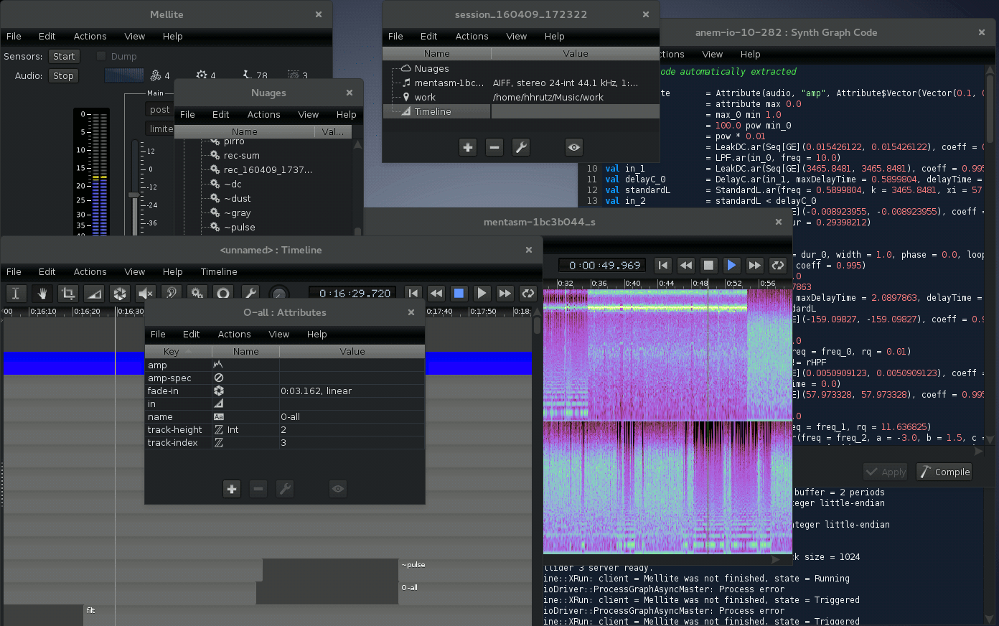

# Mellite

## statement

Mellite is a computer music application, implemented as a graphical front end for [SoundProcesses](http://github.com/Sciss/SoundProcesses). It is (C)opyright 2012&ndash;2018 by Hanns Holger Rutz. All rights reserved. Mellite is released under the [GNU General Public License](http://github.com/Sciss/Mellite/blob/master/licenses/Mellite-License.txt) v3+ and comes with absolutely no warranties. To contact the author, send an email to `contact at sciss.de`.

The `licenses` folder contains the license headers for all dependencies and transitive dependencies. For the binary release of Mellite, source code is not included but available via the respective OSS project pages, as indicated in the license files, or&mdash;in compliance with GPL/LGPL&mdash;on request via E-Mail. All source code with group-id `de.sciss` is available from [github.com/Sciss](https://github.com/Sciss).

The Mellite icon is based on the file [MELLITE Taillée Hongrie.jpg](https://de.wikipedia.org/wiki/Mellit#/media/File:MELLITE_Taill%C3%A9e_Hongrie.jpg), provided by Didier Descouens under CC BY 4.0 license.

## download

- A binary (executable) version is provided via [GitHub releases](https://github.com/Sciss/Mellite/releases/latest).
  We provide a universal zip for all platforms as well as a dedicated Debian package.
- The source code can be downloaded from [github.com/Sciss/Mellite](http://github.com/Sciss/Mellite).

## linking

The following artifact is available from Maven Central:

    "de.sciss" %% "mellite" % v

The current version `v` is `"2.27.0"`.

## building

Mellite builds with [sbt](http://scala-sbt.org/) and Scala 2.12. The last version to support Scala 2.10 is 2.10.2. The dependencies will be downloaded automatically from Maven Central repository, except for snapshots during development. For convenience, the [sbt script by Paul Phillips](https://github.com/paulp/sbt-extras) has been included, which is covered by a BSD-3-clause license. Therefore, on Linux and Mac you can just use `./sbt run` or `./sbt universal:packageBin` to get going without having to separately install sbt.

Dependencies not found are all available from their respective [GitHub repositories](https://github.com/Sciss?tab=repositories), so in case you want to build a snapshot version, you may need to check out these projects and publish them yourself using `sbt publish-local`.

See section 'running' for ways of building and installing standalone bundles.

## contributing

Please see the file [CONTRIBUTING.md](CONTRIBUTING.md)

## running

The standalone jar, created via `sbt assembly` produces `Mellite.jar` which is double-clickable and can be run via:

    $ java -jar Mellite.jar

Runnable packages can be created via `sbt universal:packageBin` (all platforms) or `sbt debian:packageBin` (Debian).

## documentation

Video and text tutorials, as well as API docs can be found online here: https://sciss.github.io/Mellite/

Note that this project is still __experimental__ in its nature, meaning that many features are incomplete or buggy, and that the application is subject to change. For example, there is no guarantee that workspaces in an older version of Mellite can still be fully opened in newer versions, although I try to minimise incompatibilities in the serialization. You have been warned!

Some notes (preferably go through the introductory video tutorials, though!):

- Mellite uses a persistent database to store your _workspace_ (Mellite's concept of a document that contains all related objects). When you create and edit objects in Mellite, these edits are automatically reflected in the database on disk. If you want to preserve a workspace, the best is thus to make a backup of it first.
- Mellite stores the workspace in a directory ending in `.mllt`. The contents of this directory can easily grow to hundreds of megabytes during the course of a composition. This is "normal" behaviour, as the database keeps track of each and every action you perform. If you are not using the _confluent_ mode, you can simply create a fresh copy of your workspace by creating a second empty workspace and using drag-and-drop of __all__ objects across the workspace. You will notice that the new workspace uses less disk space.
- To create a new workspace, choose `File > New` and select the database location. If you choose a _confluent_ workspace, you will be presented with the cursor window which contains exactly one "master" cursor. Cursors can be understood as branches in a git repository. They represent historical trajectories. In most cases you will just use the one master cursor. If you select it and press "View", you are presented with the workspace elements view. Normally, you will want to choose _durable_ workspace. An _in-memory_ workspace is not written to disk and thus will be lost when you close the application.
- The workspace elements are an arbitrarily ordered collection of objects which constitute your composition: Audio files, timelines, sound processes (`Proc`), actions, numbers and strings, code fragments, folders which help you to organise your elements.
- Try creating a new timeline, by pressing the `+` button in the document elements view and selecting `Timeline`. Once this object has been created, select it and press the eye button to view it. This presents you with a rather traditional timeline view. Cursor and mouse navigation is somewhat similar to Eisenkraut and Kontur.
- To create an audio region on the timeline, there are two possibilities. The most straight forward one is to open the sound file in Eisenkraut, make a selection and perform a Drag-and-Drop using the "Region" button in Eisenkraut. After you drop the region, Mellite will try to figure out the "location" of the sound file. Every sound file must be associated with an `ArtifactLocation` which is any parent folder of the sound file. The reason for this is that you may migrate your session to other computer or hard-drive, so we want to be able to adjust all sound file paths based on an exchange of their location. If there are no location objects in your session, Mellite will prompt you to choose a parent folder of the new sound file, for which a location object will then be created. You can also manually create artifact locations in the document elements view.
- The second possibility is to add the sound file to the workspace elements view, then open the file (select it and press the eye button). This opens a spectrogram overview of that sound. Make a selection and use the "Region" button to perform a drag-and-drop operation onto the timeline.
- Sound processes have signal inputs and outputs (internally called "scans"). An audio file region by default has one output slot which is _not connected_. Therefore, starting the transport of the timeline will not have any audible effect. You first need to create an additional process which outputs to the sound hardware. The easiest approach is to add a _global_ process (one that does not have a time span). The global processes are shown in the left hand side of the timeline windows. The `+` button can be used to add a new process. Select an appropriate default process from the wizard (e.g. 1-to-1 for mono sound file to mono output). You can edit the code of the process afterwards if you wish to customise it. Processes are described by any valid [ScalaCollider](http://github.com/Sciss/ScalaCollider) `SynthGraph` body, plus there are additional elements contributed by [SoundProcesses](http://github.com/Sciss/SoundProcesses) and Mellite.
- You create a signal input via `ScanIn("my-name")` or `ScanInFix` (the latter assumes a fixed number of input channels). You may then use this input graph element and write it straight to an output, e.g. `Out.ar(0, ScanIn())` will route an input to the first sound card channel(s) output.
- To associate a global process as output for an audio region, click on it in the list and drag-and-drop it onto the audio region in the timeline window. When you select an audio region, the corresponding connected global processes are automatically shown selected in the list. To disconnect, perform the drag-and-drop again.
- You can also create programmatic regions on the timeline with the function tool (icon from the tool bar resembling the synth def icon in [ScalaCollider-Swing](http://github.com/Sciss/ScalaColliderSwing)). By clicking and dragging you create a new hollow region. Again you can edit the synth graph by double-clicking on the object with the function tool selected. You can connect processes with the patch tool (circular icon, looks like the Pure Data cursor). You start in the source process and drag to the sink process. Slots have to be made available by using `ScanIn` and `ScanOut` in the synth graphs of the processes, and by explicitly creating outputs in the outputs tab of the graph editor (collapsed on the right hand side of the window by default).
- There are a number of parameters which can be accessed in the synth graph. Scalar attributes are embedded using `"name".ir(default-value)` or `"name".kr(...)`. Mellite automatically feeds the gain settings into an attribute called `"gain"`. The gain settings are modified using the gain tool (up-down arrow). It also feeds the mute settings into an attribute called `"mute"` (1 is muted, 0 is not muted). The mute tool has a loudspeaker icon with an X. Finally, fade-in and out are available through the `FadeInOut` graph element. You will typically write `FadeInOut.ar` and multiple the payload signal with this. The fades can be adjusted with the fade tool which is has a triangular icon.
- Actual sound production during transport must be enabled by booting the ScalaCollider server. This is done through the `boot` button in Mellite's main and first window. You can specify the sound device to use and the number of output channels in the preferences.

As you have already guessed, you will need to be very inquisitive and patient to use this program! Don't hesitate to ask on the [Gitter channel](https://gitter.im/Sciss/Mellite).
